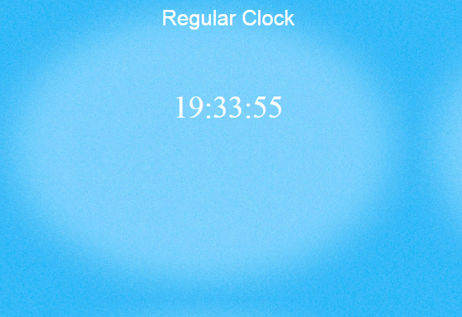
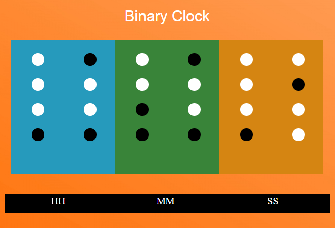
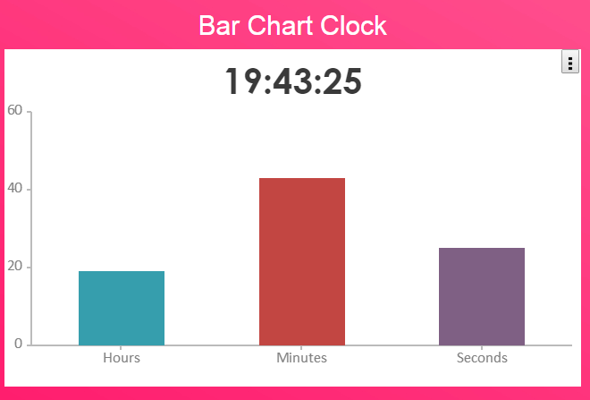
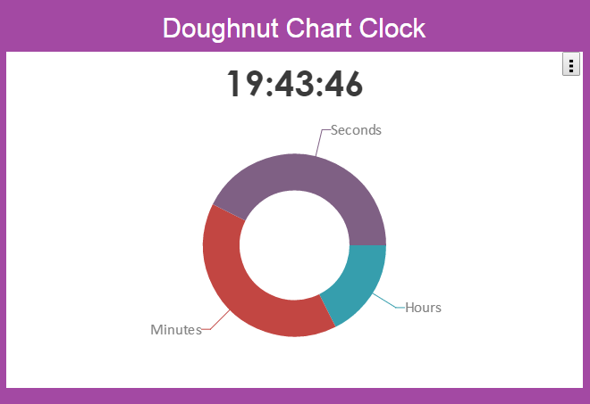
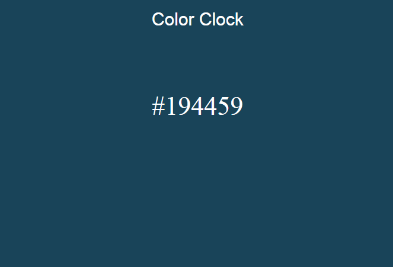
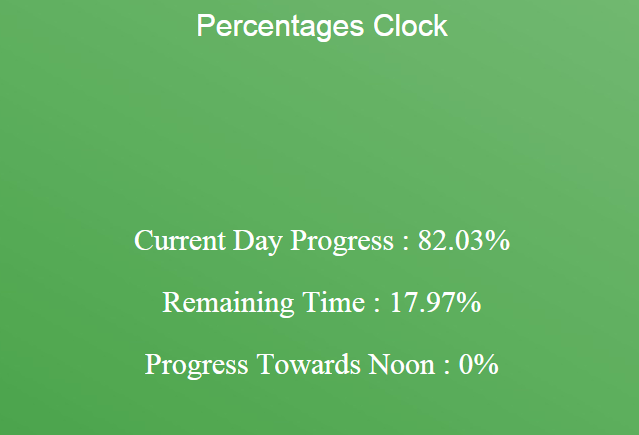
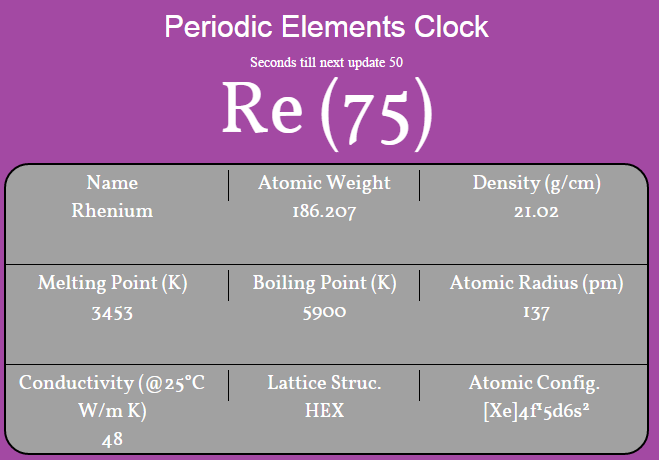
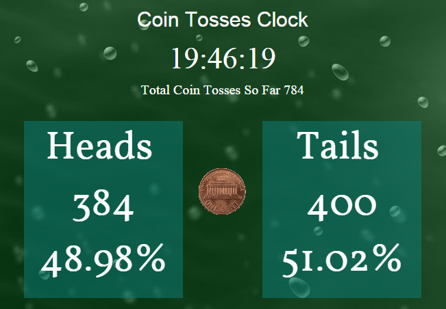
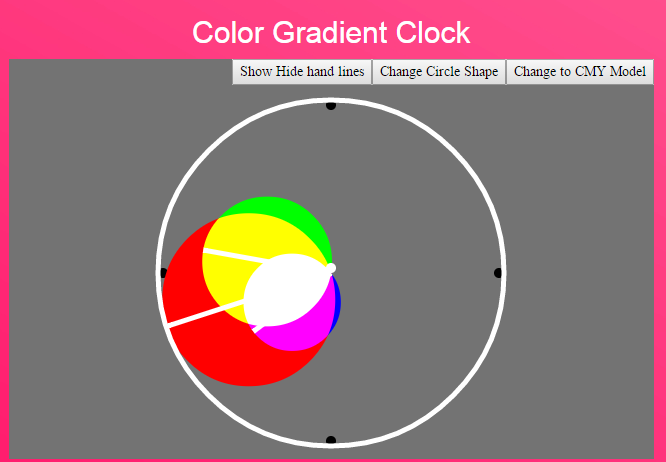
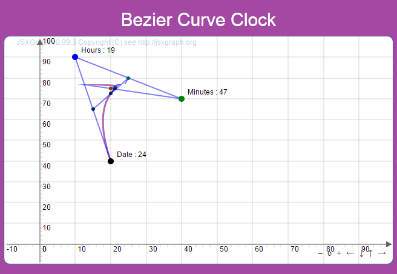

#Innovative Clocks

<b><i>Please note : Even though title says Binary Clock, this was my initial project when I started writing this app. 
But as usual I digressed and Continued adding more and more types of innovative clocks to this project. Technically there 
are 10 different types of clocks to this project, but you can argue that some of them are NOT REALLY innovative. 
But by the way, I chose to keep name 'Innovative Clock' to this project.</i></b>

<h3>Following are 10 types of clocks added to the project and their short description :</h3>
 
- [x] <b>Regular clock</b> - As name suggests, nothing fancy about it. It is an usual digital clock which shows time in 
HH:MM:SS format 

- [x] <b>Binary Clock</b> - You may say this was my motivation when this project begun. I planned to write only for binary clock 
when they showed it in one of the internet advertising. However, as project developer I came across more and more 
interactive watches which was motivation for writing rest of interactive clock.

(To read binary clock, lower circle indicated lower bit while upped indicated higher bit. White dot - 0, Black dot - 1. 
For e.g. if a column appears as [black] [black] [white] [white] it will be perceived as 1100 which in turn converts to 
12 in decimal notation).

- [x] <b>Bar Chart clock</b> - This is a clock which indicates time in the form of bar chart. There are 3 bars representing 
hours, minutes and seconds respectively when counted from left to right.

Thanks to creators of http://canvasjs.com/ (fenopix) for providing this awesome graph plotting library. 
I thought of using D3 for data visualization but found too much overhead in terms of time and code just to achieve a 
simple task like plotting time on bar chart

- [x] <b>Pie chart clock</b> - This is very similar to Bar chart with same data except for the fact that hours, minutes and seconds 
are distributed across pie chart area in place of bars.

- [x] <b>Color Clock</b> - As name suggests this clock changes color according to current time. This was very first version that 
was built in the innovative clocks series. As we know each color can be represented in Hexadecimal format #RRGGBB, here I 
have used the same concept which changes the background color of clock according to current time. Here, HHMMSS is mapped 
to RGB value as #RRGGBB

- [x] <b>Percentages Clock</b> - This clock indicates percentage of day passed and amount of day still remaining. There are three 
parameters it provides (All in percentages). Progress of the day, amount of day remaining and percentage progress till noon.

- [x] <b>Periodic Elements Clock</b> - This clock is a reminder for me of my 10th standard syllabus. As with name, I have aligned 
the information of each element according to the current time. There are 118 elements and they are divided in 720 minutes 
window in the period of 12 hours. Metadata for each element such as atomic number, density, melting point, boiling point etc. 
Displayed as per the current time.

- [x] <b>Coin Tosses Clock</b> - This clock tosses coin for each second and plots number of heads vs.. Tails. It seems in the 
beginning that random function is biased towards particular choice, but in the long run both values seem to converge to 
50% boundary

- [x] <b>Color Gradient Clock</b> - Creates a color gradient in either RGB or CMY space and creates new color based on overlapping 
of clock hands. User is provided with options such as changing color space, circle shape and indicator for radius for each 
individual hand.

- [x] <b>Bezier Curve Clock</b> - This is a special clock and you can also call it a mathematical clock. It uses special bezier 
curve formula for drawing different curves based on the current time. In addition to it, it also has provisioning to 
display time parameter values for each node. As time changes, control points change, which in turn forces bezier curve to 
change the shape. 
Thanks to creators of http://jsxgraph.uni-bayreuth.de/ library which allowed me to created and plot bezier curve on the web app.

  
